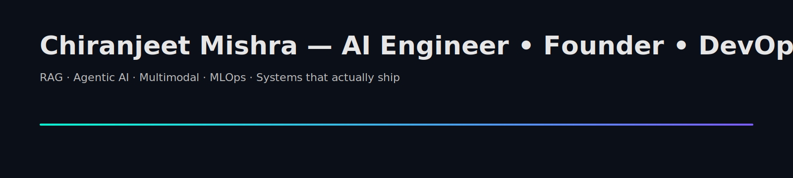

<!-- PROFILE HEADER -->

  

<h1 align="center">Hey, I’m Chiranjeet Mishra 👋</h1>

  
  
  

  <em>Story-driven builder of RAG, Agentic & Multimodal AI — shipping clean, production-ready systems.</em>

---

## 🔭 What I’m shipping
- **marketing-agent** — CrewAI agents that spin up full marketing strategy & content.  
  <a href="https://github.com/The-Thought-Magician/marketing-agent">Repo</a>
- **google-agent** — Atomic Agents + Google Workspace MCP + SearXNG/Firecrawl; dual-layer memory.  
  <a href="https://github.com/The-Thought-Magician/google-agent">Repo</a>
- **ai-hedge-fund** — Multi-agent investing PoC with backtester.  
  <a href="https://github.com/The-Thought-Magician/ai-hedge-fund">Repo</a>
- **real-time-road-lane-detection** — CV lane detection with video demo.  
  <a href="https://github.com/The-Thought-Magician/real-time-road-lane-detection">Repo</a>
- **OG-Template** — FastAPI + n8n bootstrap to build anything quickly.  
  <a href="https://github.com/The-Thought-Magician/OG-Template">Repo</a>
- **ghl-mcp-app** — Custom MCP endpoints hub.  
  <a href="https://github.com/The-Thought-Magician/ghl-mcp-app">Repo</a>

> *These are pulled from my active repos; see the Repositories tab for more.* 

---

## 🧰 Toolbox
`Python` · `TypeScript/JS` · `Golang` · `C/C++` · `PyTorch` · `TensorFlow` · `FastAPI` · `React` ·  
`Docker` · `Kubernetes` · `Terraform` · `Azure/AWS/GCP` · `Postgres` · `MongoDB` · `Redis` · `Qdrant/Pinecone`

---

## 📈 Geek-grade visuals (with private contributions)

  <!-- self-hosted readme-stats (replace YOUR-VERCEL-APP) -->
  
  

  

  

  <!-- lowlighter/metrics infographic (generated to assets/metrics.svg) -->
  

<!-- Snake animation (auto-updated by workflow) -->

  

---

## ✍️ Latest from Medium
<!-- BLOG-POST-LIST:START -->
<!-- BLOG-POST-LIST:END -->

---

  

